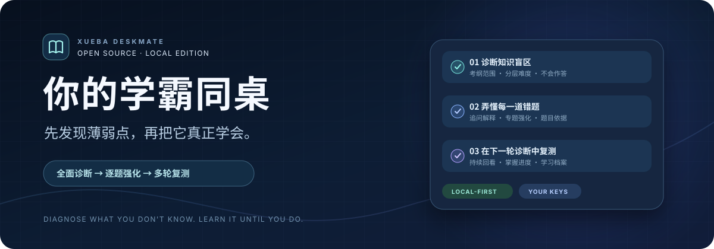

<p align="center">
  
</p>

<p align="center">
  <strong>一位会先找出你哪里不会，再陪你逐题学会的 AI 同桌。</strong><br />
  资料决定学习范围，诊断发现薄弱点，强化与复测验证是否真正掌握。
</p>

<p align="center">
  <a href="#如何工作">学习流程</a> ·
  <a href="#核心能力">核心能力</a> ·
  <a href="#快速开始">快速开始</a> ·
  <a href="#数据与隐私">数据与隐私</a>
</p>

---

## 为学习中的“我以为我会了”而做

做对一道基础题，并不代表掌握了整个知识点。「你的学霸同桌」把学习过程组织成一个可重复的循环：

> **确定范围 → 分层诊断 → 逐题讲解 → 专题强化 → 下一轮复测**

学习者可以上传教材、考纲和历年试卷，也可以检索 GitHub 上可读取且与科目相关的资料。知识地图以考纲为准；真题用于理解考法和生成练习。题目会说明对应的考纲知识点，以及是否参考了已读取的真题。

## 如何工作

| 阶段 | 学霸同桌会做什么 | 你得到什么 |
| --- | --- | --- |
| **01 · 建立范围** | 根据科目和考试目标建立初步地图，再用考纲核对 | 清楚知道需要学哪些知识点 |
| **02 · 全面诊断** | 生成不同难度的选择、判断、填空等题目 | 看见会做、不会做和可能蒙对的区别 |
| **03 · 错题突破** | 每道错题分别讲解；没听懂可针对一句话继续追问 | 贴着自己的问题学习，而非泛泛复习 |
| **04 · 强化复测** | 为同类错误保留多轮强化题，并把复测题放回后续诊断 | 用新的题目检验是否真的掌握 |

## 核心能力

- **资料驱动**：上传 PDF、DOCX、TXT、Markdown；文字版文件直接提取，扫描页按需 OCR，并记录页码和完整性。
- **来源可追溯**：GitHub 文件先筛选相关性和可读性，再进入分析；未读到正文的仓库只保留为线索。
- **诊断不靠蒙**：题目覆盖多重难度，选择题与判断题提供“不会”，答题结果进入个人学习档案。
- **强化不断档**：错题下方保留“强化 1、强化 2……”等记录，下一轮诊断继续复测。
- **模型可切换**：支持 OpenAI、通义千问、GLM；检索服务可按需要选择。
- **本地优先**：默认在自己的电脑运行，支持档案导入与导出。

## 快速开始

准备 **Node.js 22.13 或更新版本**，下载本仓库源码并在项目目录运行：

```bash
npm ci
npm run local:setup
npm run local
```

浏览器打开命令行显示的地址，通常是 `http://127.0.0.1:8787/`。第一次启动会创建本机数据库和加密密钥；以后只需 `npm run local`。

进入网站后，选择教学模型并填入**自己的 API 密钥**。模型教学需要联网；上传资料、查看已有档案等本地操作无需模型密钥。可选的 Tavily 或 GitHub 访问令牌用于联网检索。

> [!TIP]
> 不熟悉 Git？可以点页面右上角 **Code → Download ZIP**，解压后按上面的命令启动。仓库中也保留了[单独打包的源码](./xueba-deskmate-local-source.zip)。

## 数据与隐私

| 数据 | 本地版存放位置 |
| --- | --- |
| 学习空间与未同步的记录 | 当前浏览器 |
| 使用本地账号同步的档案、逐页识别正文 | 当前电脑的 `.wrangler/state/` |
| 本地密钥加密配置 | 当前电脑的 `.dev.vars` |
| 模型 API 密钥 | 当前浏览器的加密 Cookie，不写入源码或档案 |

本地账号只用于这台电脑上的本地服务，**不与线上预览站互通**。“公共资料库”在本地版也仅对连接到同一本机服务的账号可见。上传的原文件不会自动贡献；使用模型或搜索功能时，相应请求会发往你选择的服务商。

请勿把 `.dev.vars`、`.wrangler/state/` 或个人学习档案提交到公开仓库。换电脑前，建议在网站中导出档案，并备份本地数据。

## 项目结构

```text
app/         网站界面与教学、档案、资料库接口
lib/         学习档案、资料处理与复测逻辑
db/          本地数据库表结构
scripts/     本地初始化与启动脚本
tests/       核心逻辑测试
```

开发时可运行 `npm run dev`；提交代码前可运行 `npm run build` 和 `node --test tests/*.test.mjs`。

## 参与贡献

欢迎通过 [Issues](https://github.com/forlin0830/xueba-deskmate-local/issues) 反馈题目质量、资料读取和使用体验，也欢迎提交改进。请在公开讨论中移除个人学习资料、账号信息及 API 密钥。

本项目采用 [MIT License](./LICENSE)。
